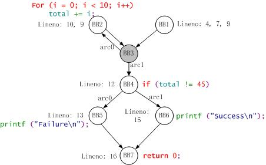
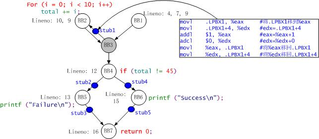

gcc下载地址：[http://gcc.parentingamerica.com/releases/](http://gcc.parentingamerica.com/releases/)

# 示例

## 编译
- 测试代码
  创建测试代码 `vim test`

- 编译
```bash
gcc -fprofile-arcs -ftest-coverage test.c -o test
```
会生成`test`和`test.gcno`文件


- 运行
  `./test`
  生成`.gcna`文件
  

**这个时候我们可以使用`gcov`生成`*.c.gcov`文件查看具体覆盖信息，也可以使用`lcov`生成html页面查看覆盖率报告**

## 收集信息
- `gcov test.c`生成`test.c.gcov`文件，里面包含了具体的源码执行信息。


## 前端展示覆盖率
>lcov是gcov的图形化的前段工具，这里我们可以将覆盖率信息图形化，生成具体的报告文档。

- 转换覆盖信息
  `lcov -c -o test.info -d .`
  - `-c`：生成覆盖率信息
  - `-o`：生成目标文件
  - `-d`：目录
  - `.`：当前目录


会生成`.c.gcov`和`.info`文件


- 生成html报告文档
  `genhtml test.info -o ./output`
  - `test.info`：用来生成报告的源文件
  - `-o`：生成结果的目录


之后产生`ouput`文件夹，里面包含了覆盖率报告


# 简介

## gcov
gcov是测试代码覆盖率的工具，在使用gcc编译的时候加上`-fprofile-arcs`和`-ftest-coverage`，之后会产生两个文件，`.gcno`和`.gcda`。
- `-ftest-coverage`产生`.gcno`文件，包含了重建基本块图和相应的块的源码的行号信息。
- `-fprofile-arcs`产生`.gcda`文件，包含了弧跳变次数和其他的概要信息。它需要先执行可执行文件才能生成（`./test`）。

gcov(gcc coverage)是一个测试代码覆盖率工具，可以统计每一行代码的执行次数以及耗时。

# 插桩原理
## 编译插桩过程
分为四个过程：预处理；编译插桩；汇编；链接
分别生成四种文件：预处理文件；汇编文件；目标文件；可执行文件

- 预处理：预处理程序对源文件进行预处理，生成预处理文件(`.i`文件)
- 编译插桩：编译插桩程序对预处理文件进行编译插桩，生成汇编文件(`.s`文件)
- 汇编：汇编程序对编译文件进行汇编，生成目标文件(`.o`文件)
- 链接：链接程序对目标文件进行链接，生成可执行文件(`.out`或`.elf`文件)

具体命令;
- `cpp test.c -o test.i`：预处理，传入`.c`文件，生成`.i`
- `gcc -S test.i`：编译插桩：传入`.i`文件，生成`.s`文件
- `as -o test.0 test.s`：汇编：传入`.i`文件，生成`.o`文件
- `gcc -o test test.o`：链接：传入`.o`文件，生成`test`可执行文件

## gcov原理
我们可以知道，无需插桩情况下命令是
```bash
  gcc test.c -o test
```
直接由源文件生成可执行文件
需要插则是
```bash
gcc -fprofile-arcs -ftest-coverage test.c -o test
```
可以发现`-fprofile-arcs -ftest-coverage`就是让gcc完成插桩的关键
`-fprofile-arcs `会产生`.gcno`文件，在gcov种，会读取该文件，重组每一个可执行程序的程序流图
`-ftest-coverage`会产生`.gcda`文件，该文件包含每个指令分支的执行次数信息。
相比与未插桩，插桩时会多出一些上诉的数据文件，基本流程如图：


上图中的`.ba`和`.bbg`文件，后期gcc版本变成了`.gcno`文件；
当我们之后运行可执行文件(`./test`)，会产生`.da`文件，后期版本变成了`.gcda`文件。

下面将在`.s`汇编文件种比较插桩前后的汇编代码。
对于源文件`test.c`
```c
00001: #include
00002:
00003: int main ( void )
00004: {
00005:    int i , total ;
00006:
00007:    total = 0 ;
00008:
00009:    for ( i = 0 ; i < 10 ; i ++ )
00010:    total += i ;
00011:
00012:    if ( total != 45 )
00013:        printf ( "Failure\n" );
00014:    else
00015:        printf ( "Success\n" );
00016:    return 0 ;
00017: }
00018:
```

###  gcda文件分析

gcda中存放了每条指令分支的执行次数，为二进制文件。下面查看其文件内容：

```c
# od -t x4 -w16 test.gcda  
0000000 67636461 34303170 c5ecae39 01000000  //'gcda', '401p', timestamp, tag=0x01000000  
0000020 00000002 00000003 eb65a768 01a10000  //length=2, ident=3, checksum, 0x01a10000  
0000040 0000000a 0000000a 00000000 00000000  //length=0xa=10, counter content: 0xa, 0, 1, 0, 1  
0000060 00000000 00000001 00000000 00000000  //8 Bytes for each counter  
0000100 00000000 00000001 00000000 a1000000  //                          , tag=0xa1000000  
0000120 00000009 00000000 00000005 00000001  //length=9, checksum=0, counts=5, runs=1  
0000140 0000000c 00000000 0000000a 00000000  //sum_all=0xc=12(8 Bytes), run_max=0xa=10(8 Bytes)  
0000160 0000000a 00000000 a3000000 00000009  //sum_max=0xa=10(8 Bytes), tag=a3000000, length=9  
0000200 51924f98 00000005 00000001 0000000c  //same as above  
0000220 00000000 0000000a 00000000 0000000a  
0000240 00000000 00000000  
0000250  
```

gcov-dump输出结果如下：

```c
# /home/zubo/gcc/2011-04-11.gcov-dump/gcov-dump test.gcda  
test.gcda:data:magic `gcda':version `401p'  
test.gcda:stamp 3320622649  //对应下面的0xc5ecae39  
test.gcda: 01000000:   2:FUNCTION ident=3, checksum=0xeb65a768  //tag, length=2, ident, checksum  
test.gcda:  01a10000:  10:COUNTERS arcs 5 counts  //tag, length=10, 5个COUNTERS  
test.gcda:              0 10 0 1 0 1  //此处便是5个counter的值，共40字节  
test.gcda: a1000000:   9:OBJECT_SUMMARY checksum=0x00000000  
test.gcda:              counts=5, runs=1, sum_all=12, run_max=10, sum_max=10  
test.gcda: a3000000:   9:PROGRAM_SUMMARY checksum=0x51924f98  
test.gcda: 
```

### gcno文件分析

```c
# od -t x4 -w16 test.gcno   
0000000 67636e6f 34303170 c5ecae39 01000000  //magic="gcno", version="401p", stamp, tag=0x01000000  
0000020 00000009 00000003 eb65a768 00000002  //length, ident, checksum, length=2  
0000040 6e69616d 00000000 00000002 74736574  //functionname="niam"(8Bytes), length=2, filename=  
0000060 0000632e 00000004 01410000 00000009  //"test.c"(8Bytes), lineno=4, tag=0x01410000, length=9  
0000100 00000000 00000000 00000000 00000000  //9 blocks' content, all is 0  
*                                            //* represents all 0 repeated (reference 'man od')  
0000140 00000000 01430000 00000003 00000000  //tag=0x01430000, length=3, src=0, dest=1, flags=5  
0000160 00000001 00000005 01430000 00000003  //tag=0x01430000, length=3, src=1, dest=3, flags=5  
0000200 00000001 00000003 00000005 01430000  //tag=0x01430000, length=3, src=2, dest=3, flags=5  
0000220 00000003 00000002 00000003 00000005  
0000240 01430000 00000005 00000003 00000002  //tag=0x01430000, length=5, src=3, dest1=2, flags1=0  
0000260 00000000 00000004 00000005 01430000  //                                 dest2=4, flags2=5  
0000300 00000005 00000004 00000005 00000004  //tag=0x01430000, length=5, src=4, dest1=5, flags1=4   
0000320 00000006 00000000 01430000 00000005  //                                 dest2=6, flags2=0  
0000340 00000005 00000007 00000004 00000008  //tag=0x01430000, length=5, src=5, dest1=7, flags1=4   
0000360 00000003 01430000 00000005 00000006  //                                 dest2=8, flags2=3  
0000400 00000007 00000004 00000008 00000003  //tag=0x01430000, length=5, src=6, dest1=7, flags1=4  
                                             //                                 dest2=8, flags2=3  
0000420 01430000 00000003 00000007 00000008  //tag=0x01430000, length=3, src=7, dest=8, flags=1  
0000440 00000001 01450000 0000000a 00000001  //tag=0x01450000, length=10, blockno=1  
0000460 00000000 00000002 74736574 0000632e  //lineno=0, length=2, filename="test.c"  
0000500 00000004 00000007 00000009 00000000  //lineno=4, lineno=7, lineno=9, lineno=0  
0000520 00000000 01450000 00000009 00000002  //lineno=0, tag=0x01450000, length=9, blockno=2  
0000540 00000000 00000002 74736574 0000632e  //lineno=0, length=2, filename="test.c"  
0000560 0000000a 00000009 00000000 00000000  //lineno=10, lineno=9, lineno=0, lineno=0  
0000600 01450000 00000008 00000004 00000000  //tag=0x01450000, length=8, blockno=4, lineno=0  
0000620 00000002 74736574 0000632e 0000000c  //length=2, filename="test.c", lineno=12  
0000640 00000000 00000000 01450000 00000008  //lineno=0, lineno=0, tag=0x01450000, length=8  
0000660 00000005 00000000 00000002 74736574  //blockno=5, lineno=0, length=2, filename="test.c"  
0000700 0000632e 0000000d 00000000 00000000  //           lineno=13, lineno=0, lineno=0  
0000720 01450000 00000008 00000006 00000000  //tag=0x01450000, length=8, blockno=6, lineno=0  
0000740 00000002 74736574 0000632e 0000000f  //length=2, filename="test.c", lineno=15  
0000760 00000000 00000000 01450000 00000008  //lineno=0, lineno=0, tag=0x01450000, length=8  
0001000 00000007 00000000 00000002 74736574  //blockno=7, lineno=0, length=2, filename="test.c"  
0001020 0000632e 00000010 00000000 00000000  //         , lineno=16, lineno=0, lineno=0  
0001040  
```

dump后：

```assembly
# /home/zubo/gcc/2011-04-11.gcov-dump/gcov-dump test.gcno  
  
//magic:version，和stamp，对应下面的0xc5ecae39，与test.gcda一一对应  
test.gcno:note:magic `gcno':version `401p'  
test.gcno:stamp 3320622649  
test.gcno: 01000000:   9:FUNCTION ident=3, checksum=0xeb65a768, `main' test.c:4  
       //: tag=0x01000000,length=9,tagname=FUNCTION,function的信息(ident,checksum,函数名,文件名,行号)  
  
//以下为9个BLOCKS记录  
//说明具有9个block
test.gcno:  01410000:   9:BLOCKS 9 blocks  
test.gcno:              0 0000 0000 0000 0000 0000 0000 0000 0000  //0为序号，每8个blocks为一行  
test.gcno:              8 0000                                     //8为序号，一共9个  
  
//以下为8个ARCS记录，小写的arcs和block为提示信息，大写的ARCS为tag名字  
test.gcno:  01430000:   3:ARCS 1 arcs  //tag=0x01430000:length=3:tagname=ARCS n_arcs=1，格式下同  
test.gcno:      block 0: 1:0005        //blockno=0:dst=1:flags=0005  
test.gcno:  01430000:   3:ARCS 1 arcs  
test.gcno:      block 1: 3:0005  
test.gcno:  01430000:   3:ARCS 1 arcs  
test.gcno:      block 2: 3:0005  
test.gcno:  01430000:   5:ARCS 2 arcs  //2个arcs  
test.gcno:      block 3: 2:0000 4:0005 //有两个目的地，格式：blockno=3: dst1=2:flags1 dst2=4:flags2  
test.gcno:  01430000:   5:ARCS 2 arcs  
test.gcno:      block 4: 5:0004 6:0000  
test.gcno:  01430000:   5:ARCS 2 arcs  
test.gcno:      block 5: 7:0004 8:0003  
test.gcno:  01430000:   5:ARCS 2 arcs  
test.gcno:      block 6: 7:0004 8:0003  
test.gcno:  01430000:   3:ARCS 1 arcs  
test.gcno:      block 7: 8:0001  
  
  //说明每个块的具体行
//以下为6个LINES记录，小写的block为提示信息，大写的LINES为tag名字  //说明line分为6部分，分别位于block1,2,4,5,6,7
test.gcno:  01450000:  10:LINES           //tag=0x01450000:length=10:tagname=LINES  
test.gcno:      block 1:`test.c':4, 7, 9  //blockno=1:'文件名':lineno1=4,lineno2=7,lineno3=9  
test.gcno:  01450000:   9:LINES  
test.gcno:      block 2:`test.c':10, 9  
test.gcno:  01450000:   8:LINES  
test.gcno:      block 4:`test.c':12  
test.gcno:  01450000:   8:LINES  
test.gcno:      block 5:`test.c':13  
test.gcno:  01450000:   8:LINES  
test.gcno:      block 6:`test.c':15  
test.gcno:  01450000:   8:LINES  
test.gcno:      block 7:`test.c':16 
```

### 基本块流图

这里我们可以发现程序分为了9个block，各个block的arcs关系也列出来了，那么我们可以输出它的程序块流图。


其中`block0`和`block8`并没有具体的行数，那么我们简化一下。



这边关于for循环，我们可以发现BB1和BB2都有line9，for循环首先是执行初始化语句，之后执行判断语句，返回true则执行循环体语句，之后执行循环迭代语句，再次进入判断语句。故BB1进行`i=0`初始化，BB2进行`i<10`判断，BB3进行`i++`循环迭代语句和`total+=10`循环体语句。

## 插桩对比

### 未插桩汇编代码

```bash
gcc -s test.i
```

```assembly
 .file    "test.c"  
    .section    .rodata  
.LC0:  
    .string    "Failure"  
.LC1:  
    .string    "Success"  
    .text  
.globl main  
    .type    main, @function  
main:  
    leal    4(%esp), %ecx    #这几句就是保护现场  
    andl    $-16, %esp  
    pushl    -4(%ecx)  
    pushl    %ebp  
    movl    %esp, %ebp  
    pushl    %ecx  
    subl    $20, %esp  
  
    movl    $0, -8(%ebp)     #初始化total=0,total的值在-8(%ebp)中  
    movl    $0, -12(%ebp)    #初始化循环变量i=0,i的值在-12(%ebp)中  
    jmp    .L2  
.L3:  
    movl    -12(%ebp), %eax  #将i的值移到%eax中，即%eax=i  
    addl    %eax, -8(%ebp)   #将%eax的值加到-8(%ebp)，total=total+i  
    addl    $1, -12(%ebp)    #循环变量加1，即i++  
.L2:  
    cmpl    $9, -12(%ebp)    #比较循环变量i与9的大小  
    jle    .L3               #如果i<=9，跳到.L3，继续累加  
    cmpl    $45, -8(%ebp)    #否则，比较total的值与45的大小  
    je     .L5               #若total=45，跳到.L5  
    movl    $.LC0, (%esp)    #否total的值不为45，则将$.LC0放入%esp  
    call    puts             #输出Failure  
    jmp    .L7               #跳到.L7  
.L5:  
    movl    $.LC1, (%esp)    #将$.LC1放入%esp  
    call    puts             #输出Success  
.L7:  
    movl    $0, %eax         #返回值0放入%eax  
  
    addl    $20, %esp        #这几句恢复现场  
    popl    %ecx  
    popl    %ebp  
    leal    -4(%ecx), %esp  
    ret  
  
    .size    main, .-main  
    .ident    "GCC: (GNU) 4.1.2 20070925 (Red Hat 4.1.2-33)"  
    .section    .note.GNU-stack,"",@progbits 
```

### 插桩后汇编代码

```bash
gcc-fprofile-arcs -ftest-coverage-S test.i
```

```assembly
 .file      "test.c"  
    .section   .rodata  
.LC0:  
    .string    "Failure"  
.LC1:  
    .string    "Success"  
    .text  
.globl main  
    .type    main, @function  
main:  
    leal    4(%esp), %ecx    #这几句就是保护现场  
    andl    $-16, %esp  
    pushl    -4(%ecx)  
    pushl    %ebp  
    movl    %esp, %ebp  
    pushl    %ecx  
    subl    $20, %esp  
  
    movl    $0, -8(%ebp)     #初始化total=0,total的值在-8(%ebp)中  
    movl    $0, -12(%ebp)    #初始化循环变量i=0,i的值在-12(%ebp)中  
    jmp    .L2  
  
.L3:     
  #第一次插桩：以下这几句就是插入的桩代码
    movl    .LPBX1, %eax     #将.LPBX1移到%eax，即%eax=.LPBX1  
    movl    .LPBX1+4, %edx   #edx=.LPBX1+4  
    addl    $1, %eax         #eax=%eax+1  
    adcl    $0, %edx         #edx=%edx+0  
    movl    %eax, .LPBX1     #将%eax移回.LPBX1  
    movl    %edx, .LPBX1+4   #将%edx移回.LPBX1+4  
  #第一次插桩结束
  
  #这是BB2的执行代码，故第一次插桩在BB3到BB2中
    movl    -12(%ebp), %eax  #将i的值移到%eax中，即%eax=i  
    addl    %eax, -8(%ebp)   #将%eax的值加到-8(%ebp)，total=total+i  
    addl    $1, -12(%ebp)    #循环变量加1，即i++  
  
.L2:  
    cmpl    $9, -12(%ebp)    #比较循环变量i与9的大小  
    jle    .L3               #如果i<=9，跳到.L3，继续累加  
    cmpl    $45, -8(%ebp)    #否则，比较total的值与45的大小  
    je     .L5               #若total=45，跳到.L5  
  
  #第二次插桩：以下也为桩代码  
    movl    .LPBX1+8, %eax   #eax=.LPBX1+8  
    movl    .LPBX1+12, %edx  #edx=.LPBX1+12  
    addl    $1, %eax         #eax=%eax+1  
    adcl    $0, %edx         #edx=%edx+0  
    movl    %eax, .LPBX1+8   #将%eax移回.LPBX1+8  
    movl    %edx, .LPBX1+12  #将%eax移回.LPBX1+12  
  #第二次结束
  #这是BB5的代码，故第二次插桩在BB4到BB5中
    movl    $.LC0, (%esp)    #否total的值不为45，则将$.LC0放入%esp  
    call    puts             #输出Failure  
  
  #第三部分插桩：以下也为桩代码，功能同上，不再解释  
    movl    .LPBX1+24, %eax  
    movl    .LPBX1+28, %edx  
    addl    $1, %eax  
    adcl    $0, %edx  
    movl    %eax, .LPBX1+24  
    movl    %edx, .LPBX1+28  
 #第三部分结束
 
 #这部分是BB7的代码，故第三次插桩在BB5到BB7中间
    jmp    .L7               #跳到.L7  
  
.L5:  
 #第四：以下也为桩代码，功能同上，不再解释  
    movl    .LPBX1+16, %eax  
    movl    .LPBX1+20, %edx  
    addl    $1, %eax  
    adcl    $0, %edx  
    movl    %eax, .LPBX1+16  
    movl    %edx, .LPBX1+20  
 #第四结束
 
 #这是BB6代码，故第四次插桩在BB4到BB6中
    movl    $.LC1, (%esp)    #将$.LC1放入%esp  
    call    puts             #输出Success  
 #第五 
    #以下也为桩代码，功能同上，不再解释  
    movl    .LPBX1+32, %eax  
    movl    .LPBX1+36, %edx  
    addl    $1, %eax  
    adcl    $0, %edx  
    movl    %eax, .LPBX1+32  
    movl    %edx, .LPBX1+36  
  # 第五结束
  #此部分后为BB7执行代码，故第五次插桩在BB6到BB7之间
.L7:  
    movl    $0, %eax         #返回值0放入%eax  
    
    addl    $20, %esp        #这几句回复现场  
    popl    %ecx  
    popl    %ebp  
    leal    -4(%ecx), %esp  
    ret  
  
    .size    main, .-main  
 
 #以下部分均是加入coverage选项后编译器加入的桩代码  
 
 #定义LPBX1，存放前五段桩代码
    .local   .LPBX1  
    .comm    .LPBX1,40,32  #申请命名空间，名称为.LPBX1
    .section .rodata      #只读section  
    .align   4  #.align的作用在于对指令或者数据的存放地址进行对齐
 #LPBX1定义完成
 
 #定义文件名
.LC2:                     #文件名常量，只读  
    .string  "/home/zubo/gcc/test/test.gcda"  
  
    .data                 #data数据段  
    .align   4  
  #文件定义完成
  
  #定义functions结构
.LC3:  
    .long    3            #ident=3  
    .long    -345659544   #即checksum=0xeb65a768  
    .long    5            #counters  
  #functions定义完成
  
  #定义LPBX0结构
    .align   32  
    .type    .LPBX0, @object #.LPBX0是一个对象  
    .size    .LPBX0, 52   #.LPBX0大小为52字节  
.LPBX0:                   #结构的起始地址，即结构名，该结构即为gcov_info结构  
    .long    875573616    #即version=0x34303170，即版本为4.1p  
    .long    0            #即next指针，为0  
    .long    -979544300   #即stamp=0xc59d5714  
    .long    .LC2         #filename，值为.LC2的常量  
    .long    1            #n_functions=1  
    .long    .LC3         #functions指针，指向.LC3  
    .long    1            #ctr_mask=1  
    .long    5            #以下3个字段构成gcov_ctr_info结构，该字段num=5，即counter的个数  
    .long    .LPBX1       #values指针，指向.LPBX1，即5个counter的内容在.LPBX1结构中  
    .long    __gcov_merge_add #merge指针，指向__gcov_merge_add函数  
    .zero    12           #应该是12个0  
  #定义完成
  
  #第六段插桩代码
    .text                                  #text代码段  
    .type    _GLOBAL__I_0_main, @function  #类型是function  
_GLOBAL__I_0_main:                         #以下是函数体  
    pushl    %ebp  
    movl     %esp, %ebp  
    subl     $8, %esp  
    movl     $.LPBX0, (%esp)   #将$.LPBX0，即.LPBX0的地址，存入%esp所指单元  
                               #实际上是为下面调用__gcov_init准备参数,即gcov_info结构指针  
    call     __gcov_init       #调用__gcov_init  
    leave  
    ret  
  #插桩结束，将LPBX0做参数，调用__gcov_init函数
  
    .size    _GLOBAL__I_0_main, .-_GLOBAL__I_0_main  
    .section    .ctors,"aw",@progbits      #该函数位于ctors段  
    .align 4  
    .long    _GLOBAL__I_0_main  
    .align 4  
    .long    _GLOBAL__I_0_main  
   
   .ident    "GCC: (GNU) 4.1.2 20070925 (Red Hat 4.1.2-33)"  
   .section    .note.GNU-stack,"",@progbits  
```

### 带桩点基本块流图

可以发现具体出现了5处插桩代码（其实六处，最后一处先不谈），根据注释的解释，可以发现每个插桩点的位置。

| 插桩点   | 出发BB | 目的BB | 执行次数 | 插入位置   |
| ----- | ---- | ---- | ---- | ------ |
| stub1 | BB3  | BB2  | 10   | 10行代码前 |
| stub2 | BB4  | BB5  | 0    | 13行代码前 |
| stub3 | BB5  | BB7  | 0    | 13行代码后 |
| stub4 | BB4  | BB6  | 1    | 15行代码前 |
| stub5 | BB6  | BB7  | 1    | 15行代码后 |

那么我们可以更进步画出基本块流图。



### 桩点分析

之前的五处插桩我们发现都很类似，以第一处为例。

```assembly
    movl    .LPBX1, %eax     #将.LPBX1移到%eax，即%eax=.LPBX1  
    movl    .LPBX1+4, %edx   #edx=.LPBX1+4  
    addl    $1, %eax         #eax=%eax+1  
    adcl    $0, %edx         #edx=%edx+0  
    movl    %eax, .LPBX1     #将%eax移回.LPBX1  
    movl    %edx, .LPBX1+4   #将%edx移回.LPBX1+4 
```

这里拥有一个.LPBX1的数组，每次执行到这个就将其加1，充当了一个计数器的功能。每一个计数器是.LPBX1和LPBX1+4共计8字节的数组。下方定义了这个数组

```assembly
#定义LPBX1，存放前五段桩代码
    .local   .LPBX1  
    .comm    .LPBX1,40,32  #申请命名空间，名称为.LPBX1
    .section .rodata      #只读section  
    .align   4  #.align的作用在于对指令或者数据的存放地址进行对齐
 #LPBX1定义完成
```

其属性只读，长度为40字节，共5个counter，每个counter占8字节，他们以4字节的方式对其。我们在上一节可以知道每个桩点具体的执行次数。
| 插桩点   | 出发BB | 目的BB | 执行次数 | 插入位置   | 在.LPBX1位置  |
| ----- | ---- | ---- | ---- | ------ | ---------- |
| stub1 | BB3  | BB2  | 10   | 10行代码前 | .LPBX1+0处  |
| stub2 | BB4  | BB5  | 0    | 13行代码前 | .LPBX1+8处  |
| stub3 | BB5  | BB7  | 0    | 13行代码后 | .LPBX1+24处 |
| stub4 | BB4  | BB6  | 1    | 15行代码前 | .LPBX1+16处 |
| stub5 | BB6  | BB7  | 1    | 15行代码后 | .LPBX1+32处 |

那么我们可以知道.LPBX1数组的具体信息。 

| +0   | +4   | +8   | +12  | +16  | +20  | +24  | +28  | +32  | +36  |
| ---- | ---- | ---- | ---- | ---- | ---- | ---- | ---- | ---- | ---- |
| 10   | 0    | 0    | 0    | 1    | 0    | 0    | 0    | 1    | 0    |

然后这些值被作为counter写入test.gcda文件，上文的gcda文件可以发现：

```assembly
test.gcda:  01a10000:  10:COUNTERS arcs 5 counts  //tag, length=10, 5个COUNTERS  
test.gcda:              0 10 0 1 0 1  //此处便是5个counter的值，共40字节  
```

下面看关于最后一段插桩代码分析

```assembly
 #第六段插桩代码
    .text                                  #text代码段  
    .type    _GLOBAL__I_0_main, @function  #类型是function  
_GLOBAL__I_0_main:                         #以下是函数体  
    pushl    %ebp  
    movl     %esp, %ebp  
    subl     $8, %esp  
    movl     $.LPBX0, (%esp)   #将$.LPBX0，即.LPBX0的地址，存入%esp所指单元  
                               #实际上是为下面调用__gcov_init准备参数,即gcov_info结构指针  
    call     __gcov_init       #调用__gcov_init  
    leave  
    ret  
  #插桩结束，将LPBX0做参数，调用__gcov_init函数
```

