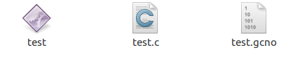
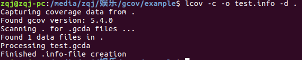
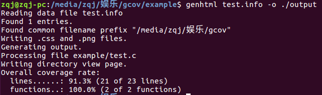
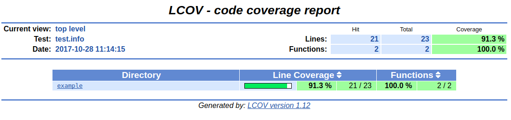
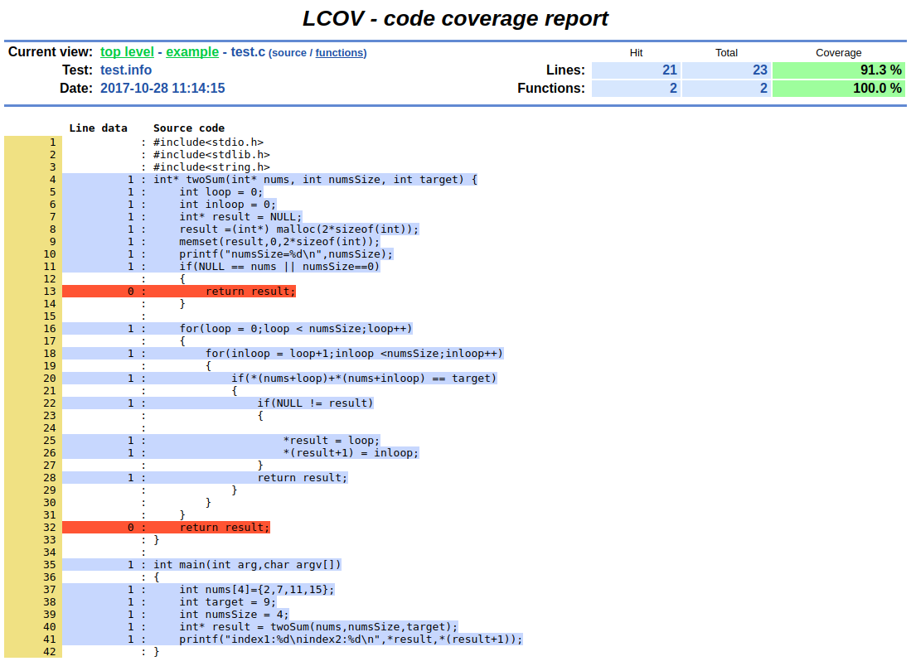

# 示例

# 编译
- 测试代码
创建测试代码 `vim test`

- 编译
`gcc -fprofile-arcs -ftest-coverage test.c -o test`
会生成`test`和`test.gcno`文件

- 运行
`./test`
生成`.gcna`文件

**这个时候我们可以使用`gcov`生成`*.c.gcov`文件查看具体覆盖信息，也可以使用`lcov`生成html页面查看覆盖率报告**

## 收集信息
- `gcov test.c`生成`test.c.gcov`文件，里面包含了具体的源码执行信息。

## 前端展示覆盖率
>lcov是gcov的图形化的前段工具，这里我们可以将覆盖率信息图形化，生成具体的报告文档。

- 转换覆盖信息
`lcov -c -o test.info -d .`
	- `-c`：生成覆盖率信息
	- `-o`：生成目标文件
	- `-d`：目录
	- `.`：当前目录

会生成`.c.gcov`和`.info`文件

- 生成html报告文档
`genhtml test.info -o ./output`
	- `test.info`：用来生成报告的源文件
	- `-o`：生成结果的目录

之后产生`ouput`文件夹，里面包含了覆盖率报告

# 简介

## gcov
gcov是测试代码覆盖率的工具，在使用gcc编译的时候加上`-fprofile-arcs`和`-ftest-coverage`，之后会产生两个文件，`.gcno`和`.gcda`。
- `-ftest-coverage`产生`.gcno`文件，包含了重建基本块图和相应的块的远吗的行号信息。
- `-fprofile-arcs`产生`.gcda`文件，包含了弧跳变次数和其他的概要信息。它需要先执行可执行文件才能生成（`./test`）。

gcov(gcc coverage)是一个测试代码覆盖率工具，可以统计每一行代码的执行次数以及耗时。

# aaAaaa