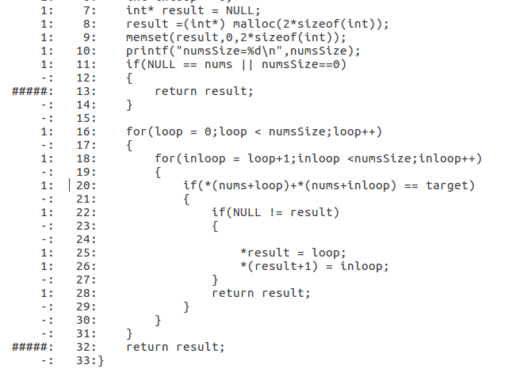
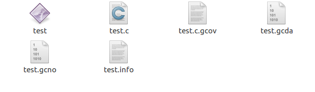
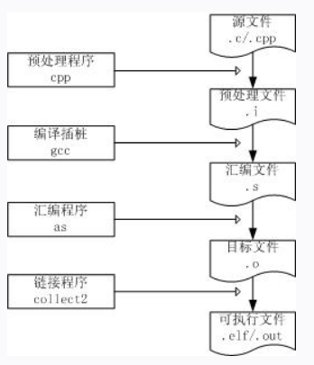
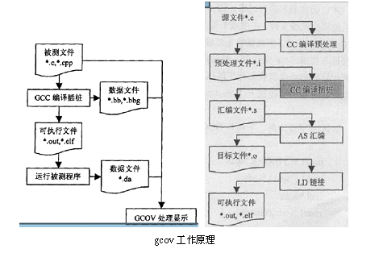

# 示例

# 编译
- 测试代码
创建测试代码 `vim test`

- 编译
```bash
gcc -fprofile-arcs -ftest-coverage test.c -o test
```
会生成`test`和`test.gcno`文件


- 运行
`./test`
生成`.gcna`文件


**这个时候我们可以使用`gcov`生成`*.c.gcov`文件查看具体覆盖信息，也可以使用`lcov`生成html页面查看覆盖率报告**

## 收集信息
- `gcov test.c`生成`test.c.gcov`文件，里面包含了具体的源码执行信息。




## 前端展示覆盖率
>lcov是gcov的图形化的前段工具，这里我们可以将覆盖率信息图形化，生成具体的报告文档。

- 转换覆盖信息
`lcov -c -o test.info -d .`
	- `-c`：生成覆盖率信息
	- `-o`：生成目标文件
	- `-d`：目录
	- `.`：当前目录


会生成`.c.gcov`和`.info`文件



- 生成html报告文档
`genhtml test.info -o ./output`
	- `test.info`：用来生成报告的源文件
	- `-o`：生成结果的目录


之后产生`ouput`文件夹，里面包含了覆盖率报告


# 简介

## gcov
gcov是测试代码覆盖率的工具，在使用gcc编译的时候加上`-fprofile-arcs`和`-ftest-coverage`，之后会产生两个文件，`.gcno`和`.gcda`。
- `-ftest-coverage`产生`.gcno`文件，包含了重建基本块图和相应的块的远吗的行号信息。
- `-fprofile-arcs`产生`.gcda`文件，包含了弧跳变次数和其他的概要信息。它需要先执行可执行文件才能生成（`./test`）。

gcov(gcc coverage)是一个测试代码覆盖率工具，可以统计每一行代码的执行次数以及耗时。

# 插桩原理
## 编译插桩过程
分为四个过程：预处理；编译插桩；汇编；链接
分别生成四种文件：预处理文件；汇编文件；目标文件；可执行文件

- 预处理：预处理程序对源文件进行预处理，生成预处理文件(`.i`文件)
- 编译插桩：编译插桩程序对预处理文件进行编译插桩，生成汇编文件(`.s`文件)
- 汇编：汇编程序对编译文件进行汇编，生成目标文件(`.o`文件)
- 链接：链接程序对目标文件进行链接，生成可执行文件(`.out`或`.elf`文件)

具体命令;
- `cpp test.c -o test.i`：预处理，传入`.c`文件，生成`.i`
- `gcc -S test.i`：编译插桩：传入`.i`文件，生成`.s`文件
- `as -o test.0 test.s`：汇编：传入`.i`文件，生成`.o`文件
- `gcc -o test test.o`：链接：传入`.o`文件，生成`test`可执行文件

## 插桩对比
我们可以知道，无需插桩情况下命令是
```bash
  gcc test.c -o test
```
直接由源文件生成可执行文件
需要插则是
```bash
gcc -fprofile-arcs -ftest-coverage test.c -o test
```
可以发现`-fprofile-arcs -ftest-coverage`就是让gcc完成插桩的关键
`-fprofile-arcs `会产生`.gcno`文件，在gcov种，会读取该文件，重组每一个可执行程序的程序流图
`-ftest-coverage`会产生`.gcda`文件，该文件包含每个指令分之的执行次数信息。
相比与未插桩，插桩时会多出一些上诉的数据文件，基本流程如图：


上图中的`.ba`和`.bbg`文件，后期gcc版本变成了`.gcno`文件；
当我们之后运行可执行文件(`./test`)，会产生`.da`文件，后期版本变成了`.gcda`文件。

下面将在`.s`汇编文件种比较插桩前后的汇编代码。
对于源文件`test.c`
```c
00001: #include
00002:
00003: int main ( void )
00004: {
00005:    int i , total ;
00006:
00007:    total = 0 ;
00008:
00009:    for ( i = 0 ; i < 10 ; i ++ )
00010:    total += i ;
00011:
00012:    if ( total != 45 )
00013:        printf ( "Failure\n" );
00014:    else
00015:        printf ( "Success\n" );
00016:    return 0 ;
00017: }
00018:
```
